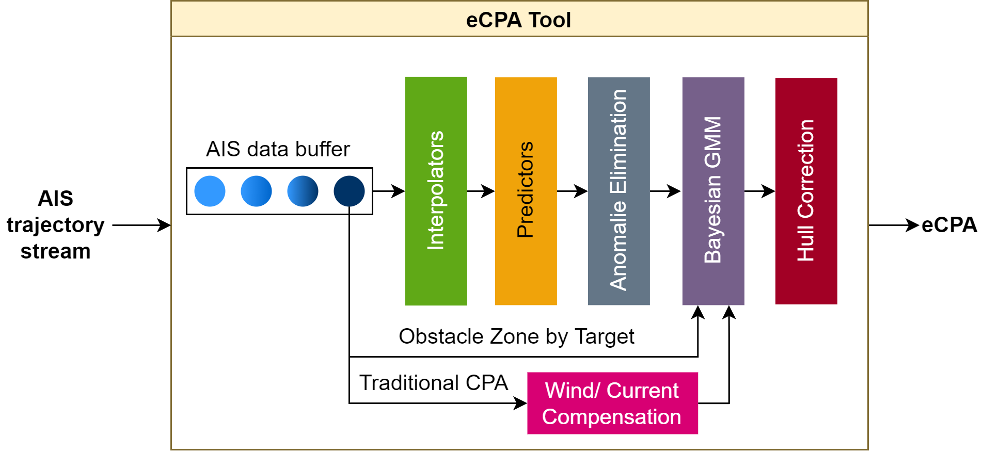

# Steering Towards Maritime Safety with True Motion Predictions Ensemble

## Introduction

This repository contains the code for paper titles: "Steering Towards Maritime Safety with True Motion Predictions Ensemble"

As illustrated in Figure, the main components of the pipeline include user adaptable methods of
trajectories interpolation, prediction, anomalies elimination,

## Requirements

To install all the requirements, one needs to first install:

+ conda
+ poetry

A detailed list of the required libraries can be found in:

+ poetry.toml

The proper installation must then be done with poetry and conda.

## Generated Encounter Scenarios

## Contributing

By considering the actual dimensions and headings
of vessels, as well as environmental factors such as wind
and current, the eCPA method provides a more accurate and
reliable assessment of collision risks.

## Authors and acknowledgment
[gaf,stu222518, sga]@informatik.uni-kiel.de

## License
We use the MIT license, see

+ LICENSE

## Citation